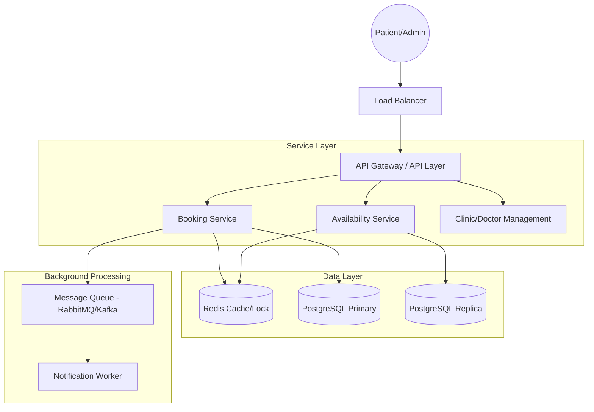

# 🏥 Mini Appointment Booking System Design

A comprehensive backend system design for a scalable, multi-clinic appointment booking platform. This project focuses on solving critical distributed systems challenges like **concurrency control**, **data consistency**, and **high availability**.

---

## 🚀 Overview

This repository contains the architectural blueprint for a modern appointment booking system. It is designed to handle thousands of concurrent users across multiple clinics while ensuring that no two patients can book the same slot simultaneously.

### Key Highlights

- **Zero Double-Bookings**: Guaranteed through a multi-layered locking strategy.
- **Scalable Architecture**: Microservices-ready design with clear separation of concerns.
- **Extensible Foundation**: Built-in support for future features like payments, video consultations, and automated notifications.
- **Learning Centric**: Includes a detailed roadmap for mastering advanced backend concepts.

---

## 🏗️ System Architecture

The system follows a layered, microservices-oriented architecture designed for horizontal scalability.

### Core Components

- **Booking Service**: Manages the lifecycle of an appointment and ensures transactional integrity.
- **Availability Service**: High-performance service for querying available slots, backed by Redis caching.
- **Distributed Locking**: Uses Redis to prevent race conditions during the booking process.
- **Message Queue**: Decouples notification logic from the main booking flow for better reliability.

---

## 🛡️ Concurrency & Data Integrity

One of the primary challenges in booking systems is preventing **double bookings**. This design implements a "Defense in Depth" approach:

1. **Distributed Locking (Redis)**: A short-lived lock is acquired on the `slot_id` before the transaction begins.
2. **Optimistic Locking (DB Level)**: Uses a `version` column in the `slots` table to ensure that the row hasn't been modified by another process during the transaction.
3. **ACID Compliance**: Leveraging PostgreSQL's transactional guarantees to ensure that slot updates and appointment creation happen atomically.

---

## 📊 Data Modeling

The system uses a highly normalized relational schema to maintain data integrity.

- **Clinics & Doctors**: Hierarchical management of healthcare providers.
- **Slots**: The atomic unit of availability, generated dynamically based on doctor schedules.
- **Appointments**: Tracks the state of a booking (Pending, Confirmed, Cancelled, Completed).

> [!TIP]
> View the full [Entity Relationship Diagram (ERD)](./system-design.md#12-entity-relationship-diagram-erd) in the system design document.

---

## 🗺️ Learning Roadmap

This project is not just a design; it's a learning journey. The repository includes a [Learning Roadmap](./learning-roadmap.md) covering:

- **Distributed Concurrency**: Mastering locks and isolation levels.
- **High-Performance Communication**: gRPC vs REST and Event-Driven patterns.
- **Database Scaling**: Sharding, Read Replicas, and Indexing strategies.
- **Observability**: Implementing Prometheus, Grafana, and Distributed Tracing.

---

## 📂 Project Structure

- [`system-design.md`](./system-design.md): Deep dive into the architecture, database schema, and sequence flows.
- [`learning-roadmap.md`](./learning-roadmap.md): A curated path to elevate your backend engineering skills.

---

## 🛠️ Tech Stack (Proposed)

| Layer | Technology |
| :--- | :--- |
| **Language** | Go / Node.js / PHP (Laravel) |
| **Database** | PostgreSQL |
| **Caching/Locking** | Redis |
| **Messaging** | RabbitMQ / Kafka |
| **Communication** | gRPC (Internal), REST (External) |
| **Observability** | Prometheus, Jaeger, Grafana |

---

## 📄 License

This project is licensed under the MIT License - see the [LICENSE](LICENSE) file for details.
