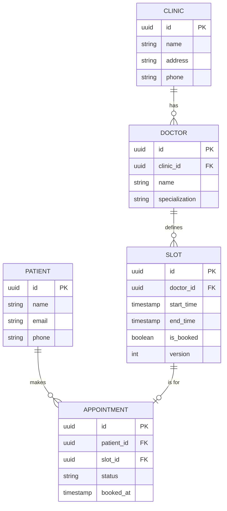
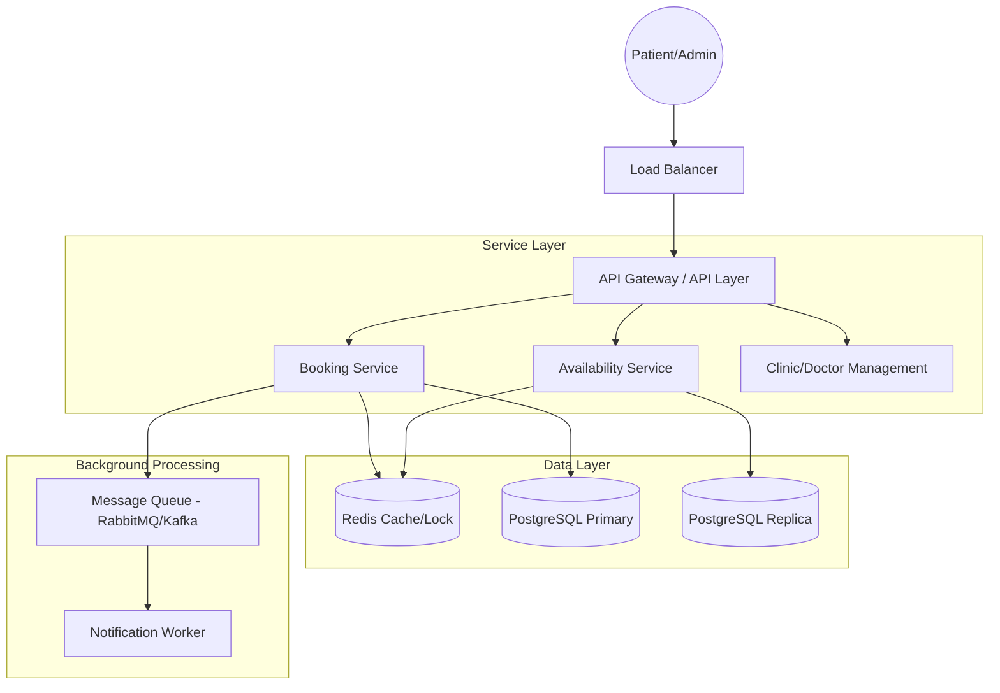
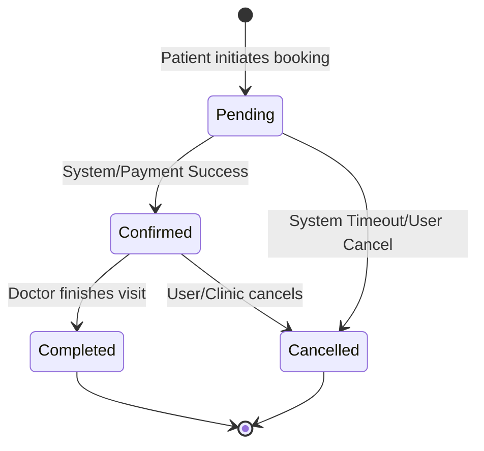
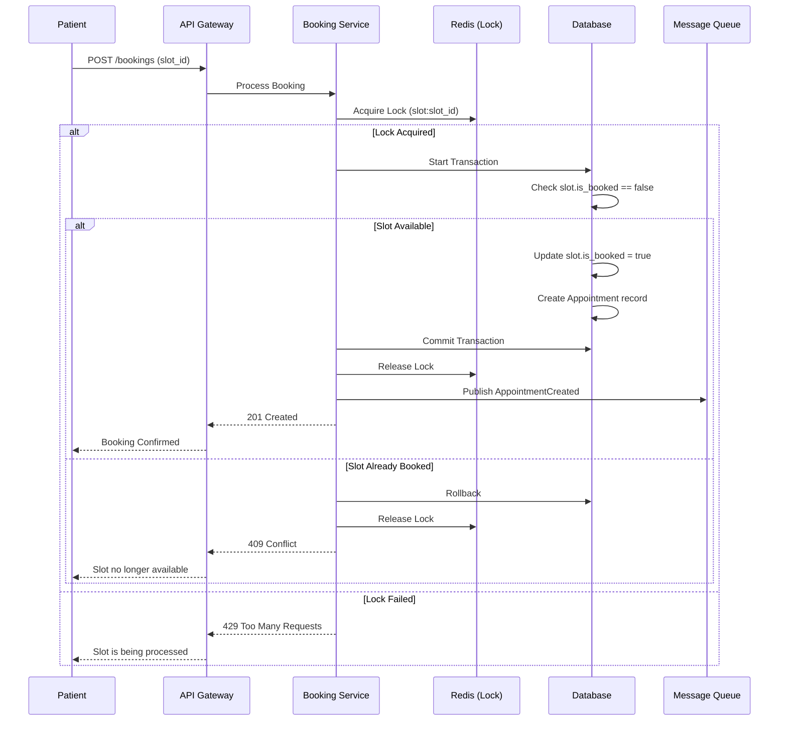

# Backend System Design: Mini Appointment Booking System

## Executive Summary

This document outlines the backend architecture for a scalable, multi-clinic appointment booking platform. The design prioritizes **data consistency** (to prevent double bookings), **high availability** (to handle thousands of concurrent users), and **extensibility** (to support future features like payments and virtual consultations). The system uses a microservices-oriented approach with a robust data layer combining PostgreSQL for ACID compliance and Redis for high-performance locking and caching.

## 1. Entity Design & Data Modeling

### 1.1 Database Schema (Relational)

We will use a relational database (e.g., PostgreSQL) to ensure ACID compliance, which is critical for financial and booking consistency.

#### **Clinics Table**

| Column | Type | Description |
| :--- | :--- | :--- |
| `id` | UUID (PK) | Unique identifier for the clinic |
| `name` | VARCHAR(255) | Name of the clinic |
| `address` | TEXT | Physical address |
| `phone` | VARCHAR(20) | Contact number |
| `created_at` | TIMESTAMP | Record creation time |

#### **Doctors Table**

| Column | Type | Description |
| :--- | :--- | :--- |
| `id` | UUID (PK) | Unique identifier for the doctor |
| `clinic_id` | UUID (FK) | Reference to Clinics table |
| `name` | VARCHAR(255) | Doctor's full name |
| `specialization` | VARCHAR(100) | Area of expertise |
| `bio` | TEXT | Short description |

#### **Patients Table**

| Column | Type | Description |
| :--- | :--- | :--- |
| `id` | UUID (PK) | Unique identifier for the patient |
| `name` | VARCHAR(255) | Patient's full name |
| `email` | VARCHAR(255) | Email (Unique) |
| `phone` | VARCHAR(20) | Phone number |

#### **Slots Table**

| Column | Type | Description |
| :--- | :--- | :--- |
| `id` | UUID (PK) | Unique identifier for the slot |
| `doctor_id` | UUID (FK) | Reference to Doctors table |
| `start_time` | TIMESTAMP | Start of the appointment |
| `end_time` | TIMESTAMP | End of the appointment |
| `is_booked` | BOOLEAN | Availability flag (Default: false) |
| `version` | INT | For optimistic locking |

#### **Appointments Table**

| Column | Type | Description |
| :--- | :--- | :--- |
| `id` | UUID (PK) | Unique identifier for the appointment |
| `patient_id` | UUID (FK) | Reference to Patients table |
| `slot_id` | UUID (FK) | Reference to Slots table (Unique) |
| `status` | ENUM | confirmed, cancelled, completed |
| `booked_at` | TIMESTAMP | Time of booking |

### 1.2 Entity Relationship Diagram (ERD)



### 1.2 Relationships & Constraints

- **One-to-Many**: A Clinic has many Doctors.
- **One-to-Many**: A Doctor has many Slots.
- **One-to-One (Logical)**: One Slot can be associated with exactly one *active* Appointment.
- **Indexes**:
  - `idx_slots_doctor_time`: On `(doctor_id, start_time)` for fast availability lookups.
  - `idx_slots_is_booked`: On `is_booked` to filter available slots quickly.
  - `idx_appointments_patient`: On `patient_id` for user history.

### 1.3 Slot Generation & Management (The Schedule Entity)

To satisfy the requirement that "Each doctor can define available time slots," we implement a **Schedule Template** system. In this design, the "Schedule" is a logical entity composed of individual `Slot` records:

- Doctors define their "Working Hours" (e.g., Mon-Fri, 9 AM - 5 PM).
- A background job or a manual trigger in the **Clinic Service** generates individual `Slot` records for the next 30 days based on these templates.
- This allows for dynamic updates; if a doctor changes their schedule, new slots are generated, and existing unbooked slots can be removed.
- **Conflict Resolution**: If a schedule change affects an *already booked* slot, the system triggers a `ScheduleConflict` event. The **Notification Service** then alerts the patient and provides options for rescheduling.

---

## 2. System Architecture

### 2.1 High-Level Architecture

The system follows a layered microservices-ready architecture. (See the attached professional architecture visualization for a conceptual overview).



### 2.2 Core Components

1. **API Layer (REST/gRPC)**:
   - **External**: REST is used for the public-facing API to ensure compatibility with web and mobile clients.
   - **Internal**: gRPC is used for inter-service communication (e.g., Booking Service calling Clinic Service) to benefit from low latency and strongly typed contracts (Protocol Buffers).
2. **Availability Service**: Fetches available slots for a doctor/clinic. Uses Redis to cache "hot" slots (e.g., for the next 48 hours) to reduce DB load.
3. **Booking Service**: Orchestrates the booking transaction.
4. **Redis**:
    - **Caching**: Stores frequently accessed schedules.
    - **Distributed Locking**: Ensures that two concurrent requests for the same slot are handled safely.

### 2.3 Management & Dynamic Updates

The system supports dynamic growth through the **Clinic Service**:

- **POST /clinics**: Onboards a new clinic.
- **POST /clinics/{id}/doctors**: Adds a new doctor to a specific clinic.
- **POST /doctors/{id}/availability**: Allows doctors to define or update their time slots.
- **Search & Discovery**: The **Availability Service** provides endpoints like `GET /slots?specialization=...&clinic_id=...` to allow patients to find relevant slots across the platform.

### 2.4 Preventing Double Bookings

To ensure data consistency and prevent two patients from booking the same slot:

1. **Database Level (Optimistic Locking)**:

    ```sql
    UPDATE slots
    SET is_booked = true, version = version + 1
    WHERE id = :slot_id AND is_booked = false AND version = :current_version;
    ```

    If the row count is 0, the booking fails because someone else updated it first.

2. **Distributed Lock (Redis)**:
    Before starting the DB transaction, the service attempts to acquire a lock in Redis for the specific `slot_id`.
    - Key: `lock:slot:{slot_id}`
    - TTL: 5-10 seconds (enough to finish the DB write).
    - If lock acquisition fails, the user is immediately notified that the slot is being processed.

---

## 3. Scalability & Extensibility

### 3.1 Scalability Strategy

- **Horizontal Scaling**: API and Service layers are stateless and can be scaled horizontally behind a Load Balancer.
- **Database Scaling**:
  - **Read Replicas**: Since searching for slots is read-heavy, we use read replicas to offload the primary DB.
  - **Sharding**: As the number of clinics grows into the thousands, we can shard the database by `clinic_id`.
- **Caching Strategy**: Use Redis to store "Available Slots" per doctor. When a booking happens, the cache is invalidated or updated.
- **Data Archiving**: To maintain performance as the system grows, historical appointment data and past slots are moved to a **Cold Storage** (e.g., Data Warehouse or S3) after 1 year, keeping the primary DB lean and fast.
- **Rate Limiting**: To prevent brute-force booking attempts and protect the system from spikes, the **API Gateway** implements rate limiting per IP and per Patient ID.

### 3.2 Extensibility for Future Features

- **SMS/Email Reminders**:
  - When an appointment is confirmed, an event `AppointmentCreated` is published to a Message Queue.
  - A **Notification Worker** consumes this event and schedules a delayed task (e.g., using Celery or a specialized scheduler) to send reminders 24 hours before the `start_time`.
- **Online Consultations**:
  - Add a `type` (In-person/Virtual) to the `Appointment` entity.
  - Integrate with a Video API (Twilio/Zoom). The `Appointment` record will store a `meeting_link` generated upon confirmation.
- **Payment Integration**:
  - Introduce a `Payments` table.
  - Change booking flow to: `Pending` -> `Payment Processing` -> `Confirmed`.
  - Use a distributed transaction or Saga pattern to handle payment success/failure and slot release.

### 3.3 Security & Real-World Constraints

Given the medical nature of the platform:

- **Data Encryption**: All PII (Personally Identifiable Information) like patient names and phone numbers are encrypted at rest (AES-256) and in transit (TLS 1.3).
- **Compliance**: The system is designed with **HIPAA/GDPR** principles in mind, ensuring audit logs for every access to patient data.
- **Audit Logs**: Every change to an appointment status or doctor schedule is logged in an immutable audit table for forensic and compliance purposes.

### 3.4 Monitoring & Observability

To manage thousands of clinics and users:

- **Metrics**: Use **Prometheus** to track request latency, error rates (4xx/5xx), and DB connection pool usage.
- **Distributed Tracing**: Use **Jaeger** or **AWS X-Ray** to trace requests across microservices, especially useful for debugging the booking flow.
- **Alerting**: Automated alerts (PagerDuty/Slack) trigger when the booking failure rate exceeds a 1% threshold.

### 3.3 Appointment State Machine



---

## 4. Booking Flow (Sequence)

### 4.1 Sequence Diagram



### 4.2 Step-by-Step Flow

1. **Patient** requests `GET /doctors/{id}/slots`.
2. **Availability Service** returns available slots (from Redis or DB).
3. **Patient** submits `POST /bookings` with `slot_id`.
4. **Booking Service** acquires Redis Lock for `slot_id`.
5. **Booking Service** starts DB Transaction:
    - Checks if `is_booked` is still `false`.
    - Updates `is_booked = true`.
    - Creates `Appointment` record.
6. **Transaction Commits**.
7. **Booking Service** releases Redis Lock.
8. **Event** published to Queue for notifications.
9. **Patient** receives `201 Created`.

---

## 5. Conclusion

The proposed design provides a solid foundation for a multi-clinic booking system. By combining **Optimistic Locking** with **Distributed Redis Locks**, we ensure a "single-source-of-truth" for slot availability. The layered architecture and event-driven notification system allow the platform to scale from a few clinics to thousands, while remaining flexible enough to integrate complex business requirements like online payments and video consultations in the future.
